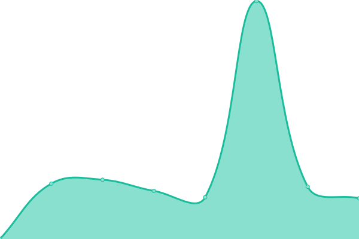

# [📈 Live Status](https://splitbrain.github.io/status): <!--live status--> **🟩 All systems operational**

This repository contains the open-source uptime monitor and status page for [Andreas Gohr](https://www.splitbrain.org), powered by [Upptime](https://github.com/upptime/upptime).

With [Upptime](https://upptime.js.org), you can get your own unlimited and free uptime monitor and status page, powered entirely by a GitHub repository. We use [Issues](https://github.com/splitbrain/status/issues) as incident reports, [Actions](https://github.com/splitbrain/status/actions) as uptime monitors, and [Pages](https://splitbrain.github.io/status) for the status page.

<!--start: status pages-->
<!-- This summary is generated by Upptime (https://github.com/upptime/upptime) -->
<!-- Do not edit this manually, your changes will be overwritten -->
<!-- prettier-ignore -->
| URL | Status | History | Response Time | Uptime |
| --- | ------ | ------- | ------------- | ------ |
|  [splitbrain.org](https://www.splitbrain.org) | 🟩 Up | [splitbrain-org.yml](https://github.com/splitbrain/status/commits/HEAD/history/splitbrain-org.yml) | 

 797ms
     
 | 

<a href="https://splitbrain.github.io/status/history/splitbrain-org">100.00%</a>
    

|  [indieblog.page](https://indieblog.page) | 🟩 Up | [indieblog-page.yml](https://github.com/splitbrain/status/commits/HEAD/history/indieblog-page.yml) | 

 586ms
     
 | 

<a href="https://splitbrain.github.io/status/history/indieblog-page">100.00%</a>
    

|  [commie.io](https://commie.io) | 🟩 Up | [commie-io.yml](https://github.com/splitbrain/status/commits/HEAD/history/commie-io.yml) | 

 623ms
     
 | 

<a href="https://splitbrain.github.io/status/history/commie-io">100.00%</a>
    

|  [man.cx](https://man.cx) | 🟩 Up | [man-cx.yml](https://github.com/splitbrain/status/commits/HEAD/history/man-cx.yml) | 

 1147ms
     
 | 

<a href="https://splitbrain.github.io/status/history/man-cx">100.00%</a>
    

|  [GotoSocial](https://fedi.splitbrain.org) | 🟩 Up | [goto-social.yml](https://github.com/splitbrain/status/commits/HEAD/history/goto-social.yml) | 

 720ms
     
 | 

<a href="https://splitbrain.github.io/status/history/goto-social">100.00%</a>
    

|  [Wiki Farm](https://i.haz.wiki) | 🟩 Up | [wiki-farm.yml](https://github.com/splitbrain/status/commits/HEAD/history/wiki-farm.yml) | 

 778ms
     
 | 

<a href="https://splitbrain.github.io/status/history/wiki-farm">100.00%</a>
    

<!--end: status pages-->

[**Visit our status website →**](https://splitbrain.github.io/status)

## 📄 License

- Powered by: [Upptime](https://github.com/upptime/upptime)
- Code: [MIT](./LICENSE) © [Anand Chowdhary](https://anandchowdhary.com), supported by [Pabio](https://pabio.com)
- Data in the `./history` directory: [Open Database License](https://opendatacommons.org/licenses/odbl/1-0/)
